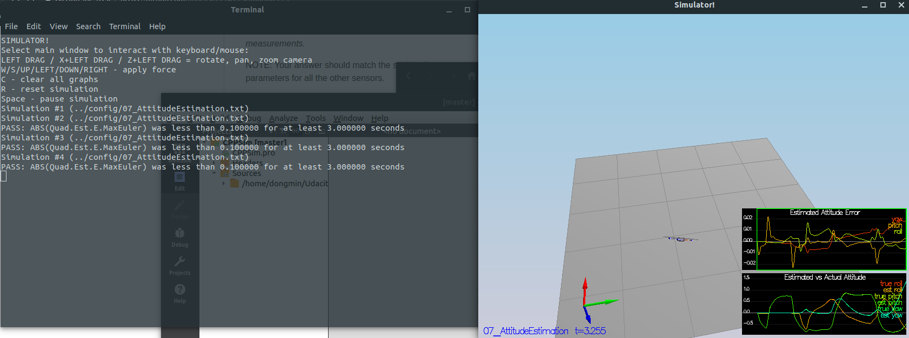
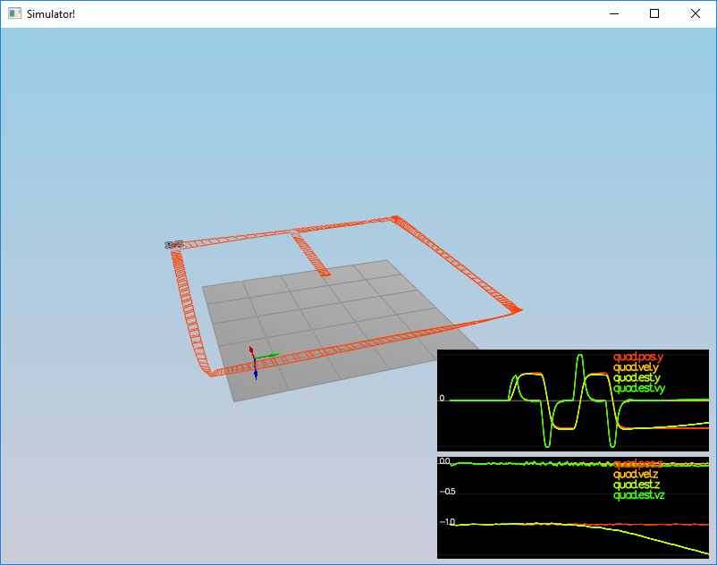

# REPORT

### Step 1 : Sensor Noise

This task is for making senor realistic. I changed sensor's std, so sensor values got noise like real world.

### Step 2: Attitude Estimation

In this task, using complimentary filter, estimated attitude(Roll and Pitch).

### 3.Prediction Step

 This step has two parts. In the first part, we predict the state based on the acceleration measurement. When modify `PredictState()`  code, we can see the result in README.md files step.3

The second part we update the covariance matrix and finish the EKF state using the equations on the Estimation for Quadrotors. After implement `Predict()` and `GetRbgPrime()` functions we can see some images in README.md step3-5 images. There are several images depend on  `QPosXYStd` and the `QVelXYStd` process parameters in `QuadEstimatorEKF.txt`. Below one is example about good covariance.

### Step 4: Magnetometer Update

After implemented magnetometer update in the function `UpdateFromMag()`,  can see below image.

### Step 5, 6: Closed Loop + GPS Update & Adding Your Controller

IMU and GPS are used for estimation. After implemented the EKF GPS Update in the function `UpdateFromGPS()`, we could see drone flew in square trajectory. And then after replaced `QuadController.cpp` and  `QuadControlParams.txt` .  Tuned some (pos and vel)gains, drone flight like below picture.

